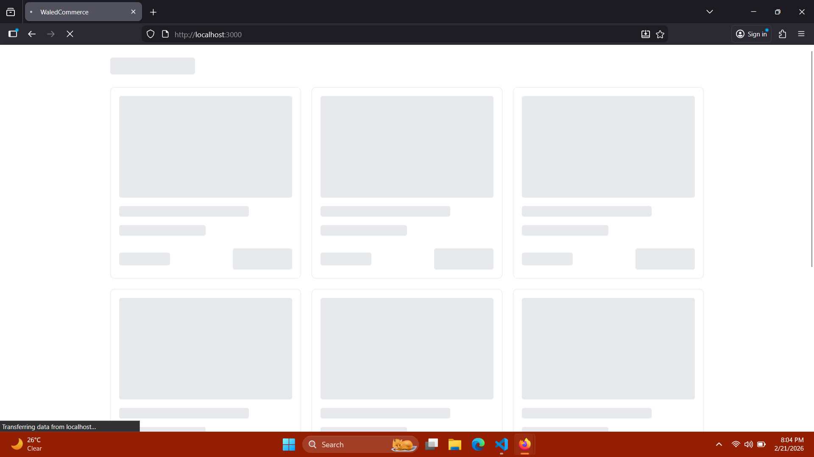
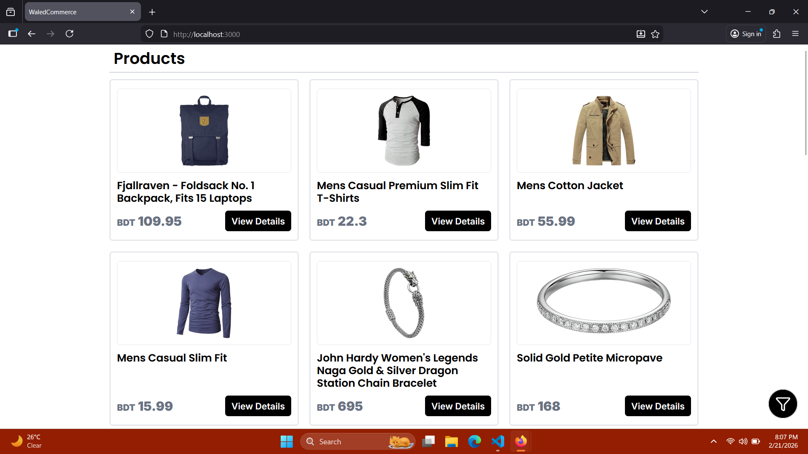
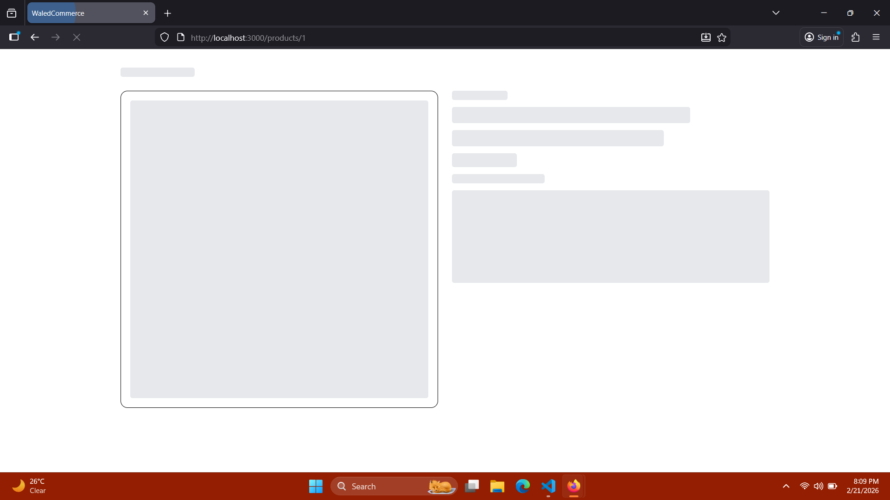
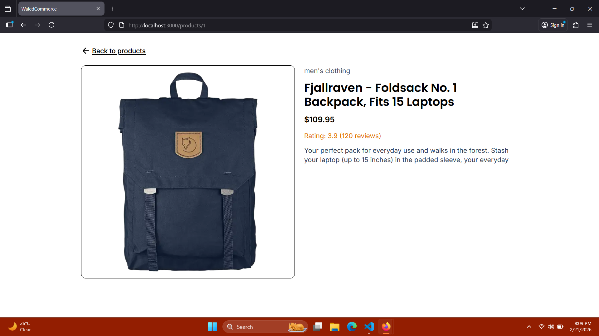
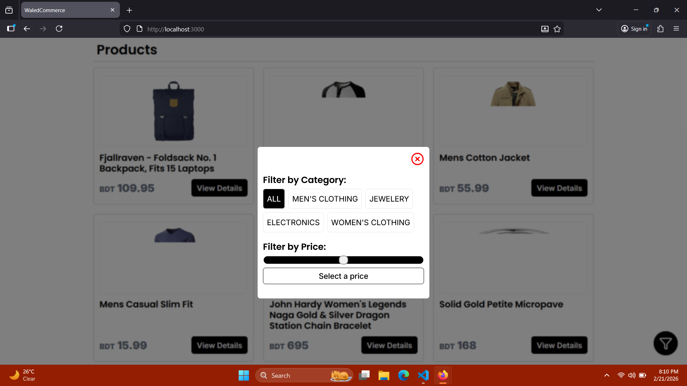

## ⚠️ Important Notice About Production Deployment

This project uses the public **FakeStore API**:

https://fakestoreapi.com/

When deployed on Vercel (or other serverless platforms), the API may return:

403 Forbidden
cf-mitigated: challenge

This happens because FakeStore API is protected by **Cloudflare bot protection**, which blocks requests coming from cloud hosting providers (like Vercel).

## 🧪 How To Run Locally

### Clone the repository:

```bash
git clone https://github.com/your-username/your-repo.git
cd your-repo
```

### Install dependencies:

```bash
npm install
```

### Build the project:

```bash
npm run build
```

### Start production server:

```bash
npm start
```

## Project Features

- Product Fetching and Skeleton Loading.
- Product Filtering by price and category.
- Responsive across mobile, tablet and desktop.
- Product details page.
- Error handling and loading state handling.

## Project structure

This project uses Nextjs 16 App Router which is inside src directory. There is also a components folder that has all the reusable components for the project.

## Project Screenshots:

### Homepage Loading



### Homepage



### Product Details Page Skeleton



### Product Details Page



### Filter Modal


